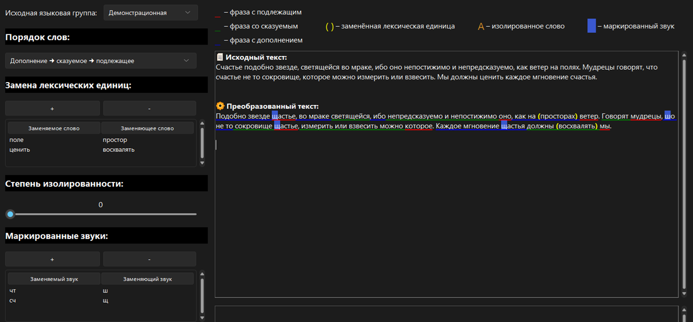

# Разработка алгоритма генерации диалогов с неигровыми персонажами на основе моделируемых языковых групп
Данная система является комбинацией сервиса [Character.ai](https://character.ai/) и методов преобразования текста на основе моделируемых языковых групп, разработанных на Python.

Разработано в рамках моей магистерской диссертации на факультете [ШРВ](https://itmo.games/) в университете [ИТМО](https://itmo.ru/).

Исходный код располагается на [GitHub](https://github.com/Yar-ick/DialogsGenerationBasedOnSimulatedLanguageGroups).

С полным текстом работы можно ознакомиться также на [GitHub](https://github.com/Yar-ick/DialogsGenerationBasedOnSimulatedLanguageGroups).

## Демонстрация
Изображение снизу демонстрирует пример работы алгоритма. Видна разница с исходным текстом, а именно:
1. Изменённый порядок слов на "Дополнение -> сказуемое -> подлежащее"
2. Заменённые лексические единицы (простор, восхвалять)
3. Заменённые маркированные звуки (ш, щ)

## Сборка и запуск
Для запуска системы требуются следующие действия:
1. Клонировать репозиторий.
2. Установить все используемые библиотеки (способ установки может различаться в зависимости от операционной системы): tkinter, sv_ttk, nltk, pymorphy3, pymystem3, spacy.
3. Запустить проект в среде разработки с возможностью отображения пользовательского интерфейса (желательно не Google Colab)
